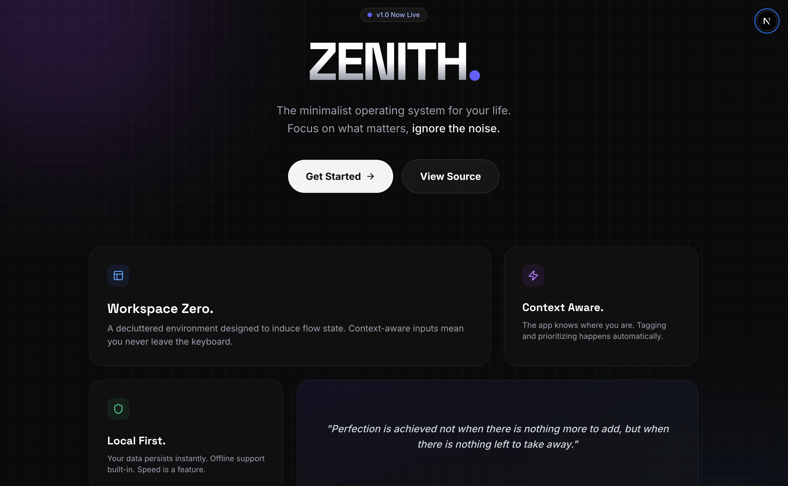
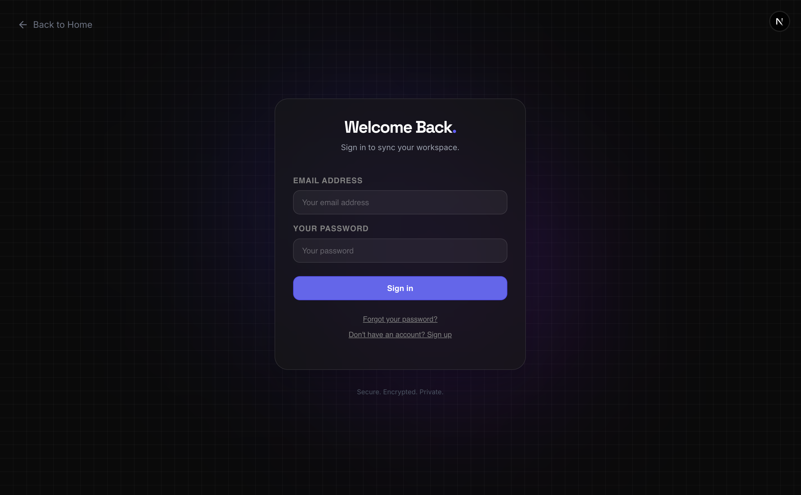
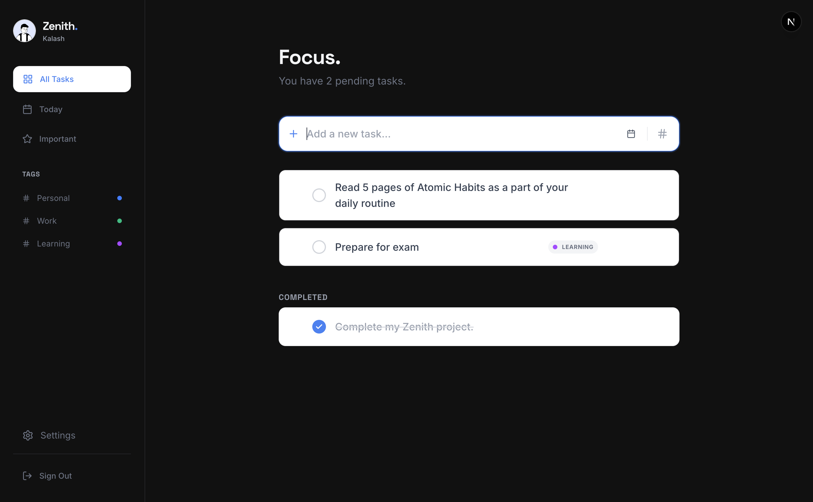
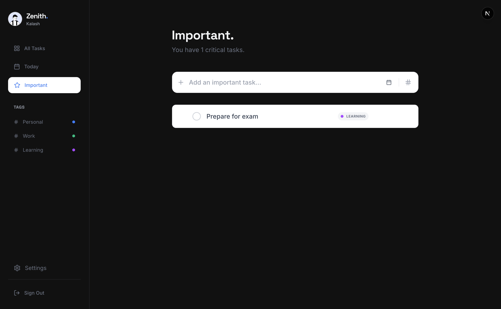
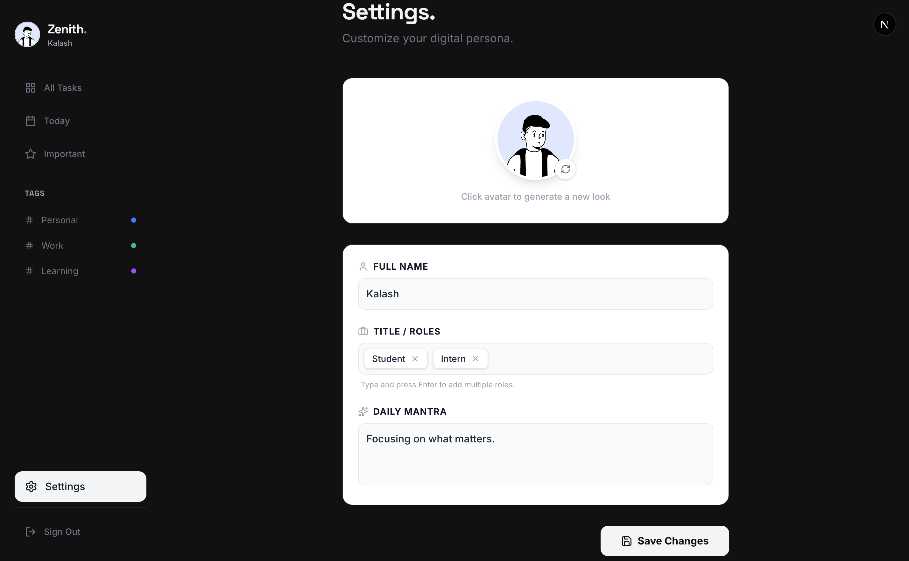

  <h1 style="font-size: 3rem; margin-bottom: 0;">ZENITH.</h1>
  
<strong>The minimalist operating system for your life.</strong>

  
Focus on what matters, ignore the noise.

  
   
  
  

 

<h2>🔮 Philosophy</h2>

  Zenith is not just another to-do list. It is a <strong>"Local-First" workspace</strong> designed to induce flow state. Built with a <strong>"Deep Zenith"</strong> aesthetic—combining aurora gradients, glassmorphism, and precision typography—it turns the mundane act of task management into a premium experience.

  It respects your time by using <strong>Smart Context</strong>: the app knows where you are. If you are in the "Important" tab, new tasks are automatically marked as high priority. If you are in "Work," they are auto-tagged. No friction, just flow.

<h2>✨ Key Features</h2>
<ul>
  <li><strong>🌌 Aurora UI:</strong> A stunning, motion-rich interface featuring background aurora effects, bento-grid layouts, and glassmorphism.</li>
  <li><strong>🧠 Smart Context Input:</strong> The input bar adapts to your current view. Adding a task in the "Important" view automatically stars it.</li>
  <li><strong>⚡ Local-First Architecture:</strong> Tasks persist instantly to local storage for 0ms latency, then sync quietly to Supabase in the background.</li>
  <li><strong>👤 Digital Persona:</strong> Customizable profile with 3D avatars (via DiceBear) and interactive "Chip" inputs for roles.</li>
  <li><strong>🛡️ Secure Authentication:</strong> A floating glass portal for authentication, powered by Supabase Auth.</li>
</ul>

<h2>📸 Gallery</h2>
<table align="center" style="border: none;">
  <tr>
    <td align="center" width="50%">
      <strong>Glass Auth Portal</strong>  
      
    </td>
    <td align="center" width="50%">
      <strong>Workspace Zero</strong>  
      
    </td>
  </tr>
  <tr>
    <td align="center" width="50%">
      <strong>Smart Context</strong>  
      
    </td>
    <td align="center" width="50%">
      <strong>Profile Settings</strong>  
      
    </td>
  </tr>
</table>

<h2>🛠️ Tech Stack</h2>
<ul>
  <li><strong>Framework:</strong> <a href="https://nextjs.org/">Next.js 15</a> (App Router)</li>
  <li><strong>Styling:</strong> Tailwind CSS + Framer Motion</li>
  <li><strong>State Management:</strong> Zustand (with Persistence Middleware)</li>
  <li><strong>Backend & Auth:</strong> Supabase (PostgreSQL)</li>
  <li><strong>Icons:</strong> Lucide React</li>
  <li><strong>Avatars:</strong> DiceBear API</li>
</ul>

<h2>🚀 Getting Started</h2>

This project is designed to run locally with a Supabase instance.

<h3>1. Clone & Install</h3>
<pre><code>git clone https://github.com/CaSh007s/todo_zenith.git
cd todo_zenith
npm install</code></pre>

<h3>2. Configure Environment</h3>

Create a <code>.env.local</code> file in the root directory:

<pre><code>NEXT_PUBLIC_SUPABASE_URL=your_local_or_cloud_url
NEXT_PUBLIC_SUPABASE_ANON_KEY=your_anon_key</code></pre>

<h3>3. Setup Database</h3>

Run the following SQL query in your Supabase SQL Editor to initialize the user profile table:

<pre><code>create table settings (
  id bigint primary key generated always as identity,
  full_name text default 'Guest User',
  title text default 'Productive Human',
  bio text default 'Focusing on what matters.',
  avatar_seed text default 'Felix'
);

-- Enable open access for local demo
alter table settings disable row level security;
insert into settings (full_name) values ('Guest User');</code></pre>

<h3>4. Run the App</h3>
<pre><code>npm run dev</code></pre>

Open <a href="http://localhost:3000">http://localhost:3000</a> to enter the workspace.

 

  Built with ❤️ by Kalash Pratap Gaur.

